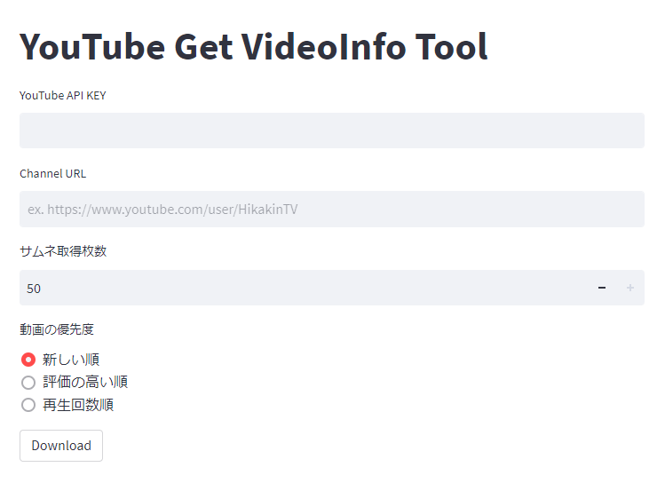

# YouTube Get VideoInfo Tool

Youtube Data APIを利用して、指定したチャンネルの動画情報（URL、再生数等）やサムネイル画像を取得するアプリです。

## Requirements

- YouTube API
- docker
- docker-compose

## Setting

```bash
docker-compose up -d --build
```

## Usage

Access to <http://localhost:8501/>

1. YouTube API, Channel URL, 動画本数, 動画の優先度を入力（動画本数はYoutube Data APIの制限上最大50）
2. 「Download」をclick
3. ``./result``にサムネ画像と動画情報をまとめたcsvファイルが出力される



## Appendix

[YouTube APIの取得方法](https://cly7796.net/blog/javascript/try-using-the-youtube-data-api/)
